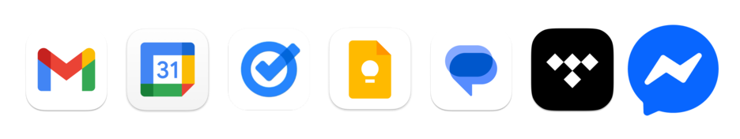
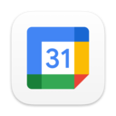

<div align="center">



# Electron Apps

**Turn any web app into a real desktop app — on macOS and Linux.**

Own icon. Own taskbar identity. A separate isolated window per account. Native notification
banners. No browser required. Even Google sign-in works, which most wrappers can't manage.

Ships with a set of apps ready to go; **[adding your own is one line](#add--change-a-service)**.

<p>


</p>

<sub>Not affiliated with or endorsed by any of the services it wraps.</sub>

</div>

---

## Included apps

These ship configured out of the box. They are a starting set, not the point — anything
with a URL can be an app here.

Tidal is the one that earns the Electron fork: it has no official Linux client, and its
audio is **Widevine-protected**, which stock Electron cannot play at all. See
[DRM / protected content](#drm--protected-content).

|  | App | Opens | Install name |
|:--:|---|---|---|
|  | **Gmail** | `mail.google.com` | `gmail` |
|  | **Google Calendar** | `calendar.google.com` | `google-calendar` |
|  | **Google Tasks** | `tasks.google.com` | `google-tasks` |
|  | **Google Keep** | `keep.google.com` | `google-keep` |
|  | **Google Messages** | `messages.google.com` | `google-messages` |
|  | **Tidal** | `listen.tidal.com` | `tidal` |
|  | **Messenger** | `messenger.com` | `messenger` |

Install all of them, **[just the ones you want](#choosing-which-apps-to-install)**, or none
of them — **[add your own](#add--change-a-service)** and build only that.

---

## Why this exists

A browser PWA is still the browser: it lives in a browser profile, dies when you sign out of
that profile, and gives you one account per profile. A plain
[Nativefier](https://github.com/nativefier/nativefier) wrapper gets you a standalone app,
but one that sites can detect as an embedded browser — Google, for instance, refuses to
sign you in at all: *"This browser or app may not be secure."*

This fixes both. Most web apps need nothing beyond a URL and an icon; the machinery below
exists for the ones that fight back.

|  | Browser PWA | Nativefier | **This** |
|---|:--:|:--:|:--:|
| Independent of your browser | ❌ | ✅ | ✅ |
| Sign-in works even on Google | ✅ | ❌ | ✅ |
| Several accounts, isolated, side by side | ❌ | ❌ | ✅ |
| Native notification banners | ✅ | ⚠️ | ✅ |
| Own taskbar / Dock identity | ⚠️ | ✅ | ✅ |
| Corporate SSO (Okta, Entra, …) completes in-app | ✅ | ❌ | ✅ |
| Links open in your real browser, right profile | ❌ | ❌ | ✅ |

---

## Quick start

```bash
git clone https://github.com/mtharpe/electron-apps.git
cd electron-apps
./build.sh          # macOS; on Linux this dispatches to ./build-linux.sh
```

It asks which apps you want, builds them, and installs them. That's the whole setup —
there is nothing to configure first and no runtime dependency beyond Node for the build.

> **Requirements**
> **macOS** — Node.js + npm (`brew install node`), Xcode command line tools (for `codesign`).
> **Linux** — Node.js + npm, a notification daemon (GNOME, KDE, …) and `libnotify`.
> Optional: ImageMagick **or** python3-Pillow to render the icon-size ladder.

---

## Features

<table>
<tr>
<td width="50%" valign="top">

**Real apps, not tabs**
Own icon, own Dock tile / taskbar entry, own app-switcher entry — not "Google Chrome". On
Linux each app gets its own `WM_CLASS`, so they never collapse into one taskbar group.

</td>
<td width="50%" valign="top">

**Even hostile sign-ins work**
A stealth layer makes the embedded Chromium indistinguishable from stock desktop Chrome,
defeating embedded-browser login blocks — Google's included.

</td>
</tr>
<tr>
<td valign="top">

**Multiple accounts, truly isolated — signed in once**
Every window has its own persistent session and cookie jar, so each can be a different
account on the same service. Sign into an account in one app and the others adopt that
session, so it's one login per account, not one per app. See
[Single sign-on across the apps](#single-sign-on-across-the-apps).

</td>
<td valign="top">

**Enterprise SSO completes in-app**
Workspace sign-in that redirects to Okta, Entra, Ping, Duo and friends finishes inside the
app, even when the IdP opens a popup. Vanity domains configurable without a rebuild.

</td>
</tr>
<tr>
<td valign="top">

**Links land in the right browser — and profile**
Links that leave the app open in your real browser, and each account window can be pinned to
a Chrome profile so work links open in your work profile.

</td>
<td valign="top">

**Native notifications**
Calendar reminders and new-mail alerts arrive as real banners, correctly attributed to the
app with its own icon.

</td>
</tr>
<tr>
<td valign="top">

**Follows your desktop**
Light/dark window chrome tracks the system setting (with a manual override), and the
installed icons follow **your icon theme**, not this repo's artwork.

</td>
<td valign="top">

**Stays out of the way**
Maximized on launch, one instance per app, background windows never throttled, and windows
recover on their own from a failed load or a wake-from-sleep with no network yet.

</td>
</tr>
</table>

---

## Install / Build

### Choosing which apps to install

This is one person's set of apps and you probably don't want all of it. Run the installer
with no arguments and it asks:

```
Which apps do you want to install?

    1) Gmail
    2) Google Calendar
    3) Google Tasks
    4) Google Keep
    5) Google Messages

Numbers ("1 3"), names ("gmail keep"), or press Enter for all:
```

Or name them up front and skip the prompt. An app answers to its short key, its slug, or
its full name, in any case:

```bash
./build-linux.sh gmail keep          # just these two
./build-linux.sh "Google Keep"       # same app, long name
./build-linux.sh --all               # everything, no prompt
./build-linux.sh --list              # show the available names and what each one opens
```

Installing a subset leaves any app you already installed alone, so you can add one later
without rebuilding the rest. With no terminal attached (CI, a pipe) the prompt is skipped
and everything is built, so scripted builds don't hang waiting for an answer.

**Adding your own:** `services.conf` is the catalogue both installers read. Append a line
and drop a matching icon in `icons/` — nothing else needs to change.

### macOS

`build.sh` will, on first run:

1. `npm install` the build deps (`electron`, `@electron/packager`),
2. package each selected service into a `.app`,
3. copy them to `~/Applications`,
4. ad-hoc code-sign each app (so macOS attributes notifications correctly).

Launch them from `~/Applications`, Spotlight, or Launchpad. Pin to the Dock via
right-click → **Options → Keep in Dock**.

### Linux

`./build-linux.sh` packages each service and installs it entirely under `$PREFIX`
(default `~/.local`) — no root, nothing outside your home:

| Path | What |
|---|---|
| `~/.local/lib/<slug>/` | the packaged Electron app |
| `~/.local/bin/<slug>` | launcher symlink (run `gmail`, `google-calendar`, …) |
| `~/.local/share/applications/<slug>.desktop` | app-menu entry |
| `~/.local/share/icons/hicolor/*/apps/<slug>.png` | icons, 16px→512px |

Launch from your desktop's app menu, or run `gmail` / `google-calendar` /
`google-tasks` / `google-keep` / `google-messages` from a shell.

```bash
./build-linux.sh                   # pick from the menu (see above)
./build-linux.sh gmail keep        # or name the apps outright
PREFIX=/some/where ./build-linux.sh
ARCH=arm64 ./build-linux.sh        # defaults to the host architecture
./build-linux.sh --uninstall       # remove every app, launcher and icon it installed
./build-linux.sh --uninstall keep  # remove just that one
```

`--uninstall` deliberately leaves your signed-in sessions
(`~/.config/<App Name>/`) alone, so a rebuild doesn't cost you every login. With no names
it removes everything — it does **not** prompt, because that is what someone typing
`--uninstall` is asking for.

#### Icons follow your icon theme

If your icon theme has its own artwork for one of these apps, that is what you get.

The app-menu and dash icons come free: the `.desktop` file says `Icon=google-keep` — a
*name*, which the desktop resolves through your active theme. Themes like Papirus, Colloid
and Numix already ship icons under exactly these names.

The one place that could not follow the theme was the icon Electron hands to the
notification daemon and the window manager, because that is a **file path**, not a name.
The installer now resolves it at install time: it reads your active icon theme (GNOME via
gsettings, KDE via `kdeglobals`), walks the theme's `Inherits` chain the way the
freedesktop spec says to, and bakes the winner in — rasterising SVG to a 256px PNG, since
Electron cannot load SVG. The build prints what it chose:

```
==> Icon theme: Colloid-Dark
==> Building Google Keep
    icon: Colloid-Dark (google-keep.svg)
```

If your theme has nothing for an app, the chain ends at `hicolor` and you get this repo's
bundled icon — which is why the bundled icons are still installed into `hicolor` even when
your theme wins. That fallback has to stay: switch to a theme that has never heard of these
apps and it is the only thing standing between you and a blank icon.

##### When your theme has no icon for an app

Themes only cover apps they know about. Tidal is a good example: Colloid ships nothing for
it, so the lookup falls through to `hicolor` and you get this repo's copy of Tidal's own
artwork — correct, but visibly not part of the icon set around it.

`icons/theme/<Theme>/` holds icons authored to match a specific theme, for exactly that
case. They are **not** installed by the build, because writing into somebody else's icon
theme is not the installer's business. Copy one in yourself:

```bash
cp icons/theme/Colloid/tidal.svg ~/.local/share/icons/Colloid-Light/apps/scalable/
gtk-update-icon-cache -qtf ~/.local/share/icons/Colloid-Dark
./build-linux.sh tidal        # so the notification icon picks it up too
```

Note the destination is **Colloid-Light** even when you run Colloid-Dark: the dark variant
symlinks `apps/scalable` at its light sibling, so that is the real location and writing
there covers both.

Re-run this after updating or reinstalling the theme — a theme update overwrites its own
directory and takes the added icon with it.

Nothing here is specific to any one theme — the installer reads whatever the machine is set
to, per install. On a box with no theme icons for these apps every one falls back to
`hicolor` and the build says so:

```
==> Icon theme: Adwaita
==> Building Google Tasks
    icon: hicolor (google-tasks.png)
```

Override the detection with `ICON_THEME` to build against a theme other than the active
one — handy for installing to someone else's setup, or previewing a theme without
switching to it:

```bash
ICON_THEME=Papirus-Dark ./build-linux.sh
```

Because this is resolved at **install** time, changing your icon theme later updates the
menu and dash icons immediately, but not the notification icon — rerun the installer to
pick that up.

---

## Usage

### Multiple accounts (one window per account)
- The app opens with **Account 1**.
- **⌘N** (or **Accounts → New Account Window**, or `⌘1`–`⌘6`) opens a new window with a
  **fully isolated session** — sign a different Google account into each. Logins persist
  per slot across restarts.
- Each app keeps its own session store, so you sign in per app.

### Single sign-on across the apps
The apps keep isolated sessions on purpose — that's what lets each window be a different
account — but it also meant signing into the *same* account once per app: five Google apps
times three accounts is fifteen logins, each with 2FA.

So an established session is shared. Sign into an account in one app, and when another app
opens a slot for that same account it adopts the session and comes up already authenticated.
One login per account.

What is and isn't shared:

- **Only an established Google web session**, and only its auth cookies — nothing else in the
  jar, no other site's cookies, no local data.
- **Keyed by the signed-in email, not the slot number.** A slot accidentally signed into the
  wrong account can't log a matching slot elsewhere out of the right one — an app only ever
  adopts a session for the identity that slot is meant to be.
- **Encrypted at rest** (AES-256-GCM) under a key kept in your OS keyring, never in a file.
  It doesn't assume a particular keyring: it tries the ones it knows (libsecret / GNOME
  Keyring, KDE Wallet, macOS Keychain) and confirms one actually works with a real
  store-and-read-back before trusting it. If none works on your machine the feature disables
  itself and nothing is ever written unencrypted — each app just signs in on its own, and the
  startup log says which keyring it used or why it's off.

This does **not** create sessions, bypass 2FA, or read anything outside these apps. It moves
an already-authenticated session between your own apps on your own machine. It also can't
help with the *first* sign-in for an account — you still do that once, however you normally
would.

The shared store lives at `~/.config/electron-apps/sessions/` (Linux) /
`~/Library/Application Support/electron-apps/sessions/` (macOS), one encrypted file per
account, named by a hash of the email.

### Notifications
- Turn on the service's own desktop notifications (e.g. Google Calendar → ⚙ Settings →
  **Notification settings → Desktop notifications**). Calendar only fires reminders while
  a Calendar view is open — which for these apps means keeping the window open.
- Test via **Help → Send Test Notification in 5s** (then click away).

**macOS**
- Banners are hidden while the posting app is **frontmost** — alerts show while you're in
  another app.
- For reminders that **persist** on screen, set
  **System Settings → Notifications → \<app\> → Alert style → Alerts**.

**Linux**
- Notifications carry the app's own name and icon, and are tagged with a `desktop-entry`
  hint matching the installed `.desktop` file — so your desktop attributes them to the
  right app and gives each one its own entry in the notification settings.
- Reminders posted by the page (what Google Calendar does) are delivered. There is one
  gap, described under [Notification paths on Linux](#notification-paths-on-linux).

### Keyboard shortcuts
`⌘` on macOS, `Ctrl` on Linux.

| Shortcut | Action |
|---|---|
| `⌘/Ctrl + N` | New isolated account window |
| `⌘/Ctrl + 1`–`6` | Open/focus Account 1–6 |
| `⌘/Ctrl + ,` | Configure accounts (names + Chrome profiles) |
| `⌘/Ctrl + R` / `⇧ + …R` | Reload / force reload |
| `⌘/Ctrl + +` / `-` / `0` | Zoom in / out / reset |
| `⌥⌘I` / `Ctrl+Shift+I` | Toggle DevTools |

---

## How it works

Each app is a thin [Electron](https://www.electronjs.org/) wrapper around one URL, built
with [`@electron/packager`](https://github.com/electron/packager). Everything below is what
turns that into something that behaves like a native app — and, where a site actively
resists being embedded, something it will actually sign you into.

| File | Role |
|---|---|
| `main.js` | Main process: per-account isolated windows, menus, request-header spoofing, permission grants, the **notification mirror** IPC handler, **external-link routing** (every window), **enterprise-SSO routing**, **per-account window titles**, the **Gmail view normalizer**, maximize-on-start, single-instance lock. Platform differences (UA, menus, link opening, icons) branch on `IS_MAC`. |
| `preload.js` | Runs in the page's main world; the **stealth layer** + the client-side **notification mirror**. |
| `accounts.html` | The **Configure Accounts…** window: a name field and a Chrome profile dropdown per account slot. |
| `accounts-preload.js` | Context-isolated bridge for that window — exposes load / save / close and nothing else. |
| `services.conf` | The service list (`name \| icon \| url \| bundle-id \| categories`), shared by both build scripts so they can't drift. |
| `select-services.sh` | Turns what the user asked for — names, menu numbers, `--all`, or nothing — into the set of services to build. Shared by both installers so they accept the same names. |
| `build.sh` | macOS: builds/installs/signs every app in `services.conf`. Builds for the host arch (or `ARCH=universal`). On Linux it hands off to `build-linux.sh`. |
| `build-linux.sh` | Linux: packages each service, installs under `$PREFIX`, writes `.desktop` files and the icon ladder, registers with the desktop. Also `--uninstall`. |
| `icons/` | 1024px `.icns` app icons (macOS). |
| `icons/png/` | PNGs extracted from those `.icns` files, used by the Linux build. Regenerated automatically if missing. |
| `docs/` | Images used by this README (the icon strip and the per-app icons), generated from `icons/png/`. |

### DRM / protected content

Some services will not play in a stock Electron at all. Tidal is the example here: its audio
is Widevine-protected, and stock Electron ships no Content Decryption Module, so playback is
impossible rather than merely degraded. Measured in stock Electron:

```
com.widevine.alpha        NotSupportedError: Unsupported keySystem
org.w3.clearkey           SUPPORTED          (built in, and no use to Tidal)
com.microsoft.playready   NotSupportedError
```

So `package.json` pins Electron to
[castlabs' Electron for Content Security](https://github.com/castlabs/electron-releases) — a
drop-in fork at the **same Electron version** (`v42.8.0+wvcus` against upstream `42.8.0`), so
every other app runs on an identical Chromium. It installs the Widevine CDM on first launch,
after which `com.widevine.alpha` is supported and `createMediaKeys()` succeeds.

Two consequences worth knowing:

- **Windows wait for the CDM.** A renderer created before it is ready never gets one, so it
  would silently fail to play for its whole life. The wait is bounded (15s) — a machine that
  wakes with no network opens its windows anyway rather than showing nothing, and logs
  `[recovery] widevine not ready`.
- **The build downloads Electron from the fork.** `ELECTRON_MIRROR` is set for you; the
  official releases have no `+wvcus` tag and the download 404s without it. For the same
  reason the build runs a bare `npm install` — naming `electron` explicitly would pull stock
  Electron from the registry and quietly break DRM playback.

Nothing else changes. If you build only the Google apps you will never notice any of this.

### Getting past Google's login block
Spoofing the User-Agent alone (what plain Nativefier does) is **not** enough — Google also
inspects JavaScript signals. `preload.js` therefore patches, in the page itself:
- `navigator.userAgentData` → Chrome brands (no "Electron"),
- `navigator.webdriver` → `false`,
- `window.chrome` → fleshed out like real Chrome,
- removes Electron/Node globals,

while `main.js` forces a Chrome **User-Agent + matching `Sec-CH-UA` client-hint headers**
on every request. Together these make the embedded Chromium indistinguishable from stock
Chrome at sign-in.

The spoof always claims the **host** platform — `Macintosh; Intel Mac OS X` on macOS,
`X11; Linux x86_64` on Linux — and `preload.js` derives `navigator.platform`,
`userAgentData.platform`, `architecture` and `platformVersion` from the same source. A
client claiming macOS while running on Linux would contradict the rest of its fingerprint,
and self-inconsistency is exactly what the "browser may not be secure" check looks for.
(The Linux values were checked field-by-field against the real Chrome on the same machine.)

### Native notifications
Google's web notifications don't all reach the desktop on their own. So `preload.js`
intercepts them and forwards a copy over IPC (`mirror-notification`) to `main.js`, which
posts it through Electron's native main-process `Notification` — the path that reliably
renders a banner.

**Which** notifications get mirrored is platform-specific, because the two platforms drop
different ones. Mirroring a notification the platform *already* delivers doesn't fail
safely — it shows the user two identical banners.

#### Notification paths on Linux
Measured on Electron 42 by watching the desktop notification bus (`org.freedesktop.Notifications`)
while firing each kind of notification:

| How the notification is posted | Electron delivers it? | What this app does |
|---|---|---|
| `new Notification(...)` from the page | ✅ yes | leave it alone — mirroring it would double every banner |
| `registration.showNotification(...)` called by the page | ❌ never | mirrored by `preload.js` |
| `showNotification(...)` from **inside** a service worker | ❌ never | **not covered** — see below |

The third row is a genuine limitation, not an oversight. Electron doesn't display
persistent notifications on Linux (the promise resolves and nothing appears), and the
worker's own scope can't be patched from the app: Electron's service-worker preload
scripts run in a *separate realm*, so a hook installed there doesn't affect the worker's
own calls — verified, the worker still sees the original `showNotification`.

In practice **Google Calendar reminders are unaffected**: Calendar only fires reminders
while a Calendar view is open, and posts them from the page, which the first two rows
cover. The gap only bites a notification pushed to a worker with no page driving it.

On macOS the mirror keeps its original, field-tested behaviour (page-level notifications
are mirrored); none of the Linux tuning changes it.

### Sandboxed renderer
Windows run with `contextIsolation: false` (so the stealth preload can patch the page's
main world) **and `sandbox: true`**. The sandbox matters beyond security: with *both* off,
Google Calendar's live-data channel (`signaler-pa.clients6.google.com`) intermittently
failed for **secondary** multi-login accounts — the "Could not load the data" error on
Workspace calendars. A sandboxed preload still patches the main world and still reaches
`ipcRenderer` (via `require('electron')`) for the notification mirror, so nothing is lost.

### Enterprise SSO routing
Most navigation to non-Google hosts opens in your real browser, but `main.js` keeps known
**identity-provider** hosts (Okta, Entra, Ping, OneLogin, Duo, Auth0, JumpCloud, CyberArk,
plus any you configure) **in-app, in the same session**, including when the IdP opens in a
popup — so corporate sign-in can complete and hand back to Google. Host matching is
suffix-based, so lookalikes (`okta.com.evil.com`) are correctly treated as external.

### External link routing
Links that leave Google (links inside emails, Calendar event details, etc.) open in your
real browser — Google Chrome, falling back to the system default. First-party Google UI
(compose pop-outs, sign-in) and recognized SSO popups stay **in-app, in the same session**.
This router is attached globally via `web-contents-created`, so it covers **every** window —
including the secondary account windows that Gmail/Calendar's account switcher opens. (It used
to be attached only to the first window, so links clicked in a second account's window opened
a dead in-app window instead of the browser.) Allowed in-app child windows inherit the opener's
per-account session, so they stay in the right cookie jar.

macOS finds Chrome by bundle name (`open -a "Google Chrome"`). Linux has no such lookup, so
the app probes `PATH` once at startup for `google-chrome`, `chromium`, `brave-browser` and
friends, and falls back to `xdg-open` (your actual default browser) if none are found. Set
**`GOOGLE_APP_BROWSER`** to a command or absolute path to override the probe on either
platform.

### Chrome profile routing
`google-chrome <url>` drops the link into whichever profile window Chrome currently has
focused, which is rarely the one the link belongs to. Chrome takes `--profile-directory=<dir>`
to pick the target explicitly, so each account slot can be pinned to one.

The mapping is keyed by **slot number**, not by email: the slot owns the cookie jar
(`persist:account-N`), it exists before any page has loaded, and it survives a window being
signed into a different account. The originating slot is recovered from the session partition
at click time, so links clicked in the secondary windows the account switcher opens route to
the same profile as their parent.

Unmapped slots (**Auto**) match themselves: Chrome records every profile's directory, display
name and signed-in address in `Local State`, and the app reads the signed-in address out of
each account window's Google Account button. Same address → that profile. The detected address
is cached in `accounts.json`, so the mapping is already known at the next launch, before any
page has painted. A slot pinned to a profile that Chrome no longer has falls back to auto
rather than routing to a profile Chrome would then invent, and **None** hands the URL over
bare (the old focused-window behaviour). The flag is only ever passed to a Chromium-family
browser — Firefox would treat it as a URL.

### Renaming accounts
**Accounts → Configure Accounts…** (`Ctrl+,` / `⌘,`) opens a window with a name field and a
Chrome profile dropdown per slot. A name set here
outranks the page-derived title below. Leave it blank and a mapped slot takes its Chrome
profile's own name, which is the point of the mapping — the two stay consistent without
typing anything.

Names and mappings are **shared by all the apps** (`~/.config/electron-apps/accounts.json`,
or `~/Library/Application Support/electron-apps/` on macOS) — "Account 2 is Work" is
a fact about your accounts, not about Gmail-the-app, so you name them once. Only the
labels and the routing are shared; the sessions stay isolated per app exactly as before. Each
app watches the file, so a name set in Gmail reaches a running Calendar without restarting it,
and saves write only the slots that changed so one app can't revert another's edit.

Two older locations are merged in on first run, gaps only — anything already in the shared
file was set later and wins. This app's pre-sharing `<userData>/accounts.json` is renamed to
`accounts.json.migrated` once folded in. The older shared directory
(`google-standalone-apps/`, from when every app here was a Google app) is **not** renamed
away: apps are installed individually, so rebuilding one of them must not strand the rest.
It stops being consulted once every app has been rebuilt, and can be deleted then.

Unlike the account windows, this window is an ordinary hardened renderer
(`contextIsolation: true`, `sandbox: true`) with its own preload exposing exactly three
calls — the stealth preferences exist for Google's sign-in gate and have no business here.
Saved values are validated in the main process rather than trusted, since `ipcMain` handlers
are reachable from any renderer.

### Desktop integration on Linux
Each service is installed under its own **slug** (`gmail`, `google-calendar`, …), and that
one string is used as the executable name, the launcher symlink, the `.desktop` **filename**,
the icon name and the window's `WM_CLASS` — so they all line up by construction:

- **`WM_CLASS`** comes from `package.json`'s `productName`, which the build bakes in per
  service. It is *not* taken from the executable name, `app.setName()`, or Chromium's
  `--class` switch — all of which are applied too late to affect it. Without this every
  app would share one `WM_CLASS` and every app would collapse into a single taskbar
  icon that no `.desktop` file could match.
- **Notification identity** comes from the `desktop-entry` hint Electron derives from the
  same name, which is why the `.desktop` filename has to match the slug too. Rename one
  without the other and notifications quietly lose their icon and their entry in the
  desktop's notification settings.

### Per-account window titles
A name set in **Configure Accounts…** (or inherited from the mapped Chrome profile) wins.
With neither, a global `web-contents-created` hook titles each window with the account/org name and
re-applies it on every load (suppressing Google's own long page title). Gmail & Calendar
expose the org name in their page title (*Acme Corp*, *Google Calendar*, …); **Keep**
and **Tasks** have no org name in their titles, so they fall back to the signed-in **email**
read off the account avatar; **Messages** exposes neither, so it keeps its page title.

### Per-app CSS
Any app can carry its own stylesheet. Two optional sources are concatenated and injected on
every document load, in every window (including the ones an account switcher opens):

| Source | Who owns it |
|---|---|
| `styles/<slug>.css` | shipped with the app, in this repo |
| `<userData>/custom.css` | yours — a rebuild never overwrites it |

Only pages on the **app's own host** are styled, so a rule written for Gmail can't run on
the sign-in page or an SSO provider's. It is injected as a stylesheet rather than an inline
style, so it survives the page re-rendering.

The one shipped example is `styles/gmail.css`, which hides Workspace Gmail's left
**Mail/Chat/Meet/Spaces** app-rail so every account matches the clean personal-Gmail layout.
It targets the rail via `:has()` anchored on the buttons' stable `aria-label`s, not Gmail's
churning class names.

To restyle any app without touching this repo, drop a `custom.css` in its config directory
(`~/.config/<App Name>/` on Linux, `~/Library/Application Support/<App Name>/` on macOS) and
restart it.

---

## Configuration

### Add / change a service
Nothing here is Google-specific. Any URL can be an app — append a line to **`services.conf`**
(`name | icon | url | bundle-id | categories`), drop in an icon, and build it:

```bash
# services.conf
"Linear|linear|https://linear.app/|com.example.linearapp|Development;ProjectManagement;"
```

```bash
./build-linux.sh linear      # build just the new one; other installed apps are untouched
```

`services.conf` is shared by both build scripts, so a service added there appears on both
platforms. Supply `icons/<name>.icns` **or** `icons/png/<name>.png` — the Linux build
extracts the PNG it needs from an `.icns` automatically, so you don't have to provide both.

One thing to get right: **point at the standalone page a human would use**, not an embedded
variant meant to live in an iframe inside another product. Those render as stripped-down
panels when loaded on their own and can't theme themselves, because they expect a parent
frame to drive them. This repo shipped exactly that bug for Tasks — see the note in
[`CLAUDE.md`](./CLAUDE.md#adding-an-app).

The last field is the [freedesktop category
list](https://specifications.freedesktop.org/menu-spec/latest/apa.html) used for the Linux
app-menu entry; macOS ignores it.

### Spoofed Chrome version
The spoofed Chrome major is derived automatically from the real bundled Chromium
(`process.versions.chrome`) in both `main.js` (`CHROME_MAJOR`) and `preload.js` (`V`), so it
can never lag the engine. If Google ever rejects the version as too old (symptom: Calendar
shows *"Could not load the data"*, or sign-in misbehaves), bump `electron` in
`package.json` and rebuild — the spoofed version follows automatically.

### Enterprise SSO / third-party login (Okta, Microsoft Entra, …)
Corporate Google Workspace sign-in usually redirects to a company identity provider — often
in a popup. Those popups are kept **in-app, in the same session**, so the SSO flow completes
and hands control back to Google (pushing them out to the external browser would break the
login). The major IdPs are recognized out of the box: **Okta, Microsoft Entra ID / Azure AD,
Ping Identity, OneLogin, Duo, Auth0, JumpCloud, CyberArk**.

If your company hosts SSO on a **vanity domain** (e.g. `login.example.com`) that isn't one of
those, add it — no rebuild needed — by either:
- setting `GOOGLE_APP_AUTH_DOMAINS` (comma/space-separated suffixes) in the app's
  environment, or
- creating a JSON array at the app's config dir, e.g.
  ```json
  ["login.example.com", "sso.example.com"]
  ```
  | Platform | Path |
  |---|---|
  | macOS | `~/Library/Application Support/<App Name>/auth-domains.json` |
  | Linux | `~/.config/<App Name>/auth-domains.json` |

Suffixes are matched against the host and its subdomains; lookalikes like `okta.com.evil.com`
are correctly treated as external.

---

## Troubleshooting

| Symptom | Fix |
|---|---|
| "This browser or app may not be secure" at sign-in | The stealth layer should handle it; if it regresses, bump the Chrome version (above). |
| Calendar: "Could not load the data" on a **Workspace** calendar | Fixed by the sandboxed renderer (secondary multi-login accounts no longer fail). If it ever recurs: `⌘R` to reload (windows also auto-reload on wake); if it happens on *first* load for everyone, the bundled Chromium may be too old — bump `electron` in `package.json` and rebuild. |
| Gmail still shows the Mail/Chat/Meet left rail | Make sure you relaunched the rebuilt app (⌘Q first). The hider keys off the buttons' `aria-label`s; if a Gmail redesign changes them it'll quietly stop matching — open an issue / update the selector in `main.js` (`GMAIL_RAIL_HIDE_CSS`). |
| Notification plays a sound but no banner | **macOS:** expected if the app is frontmost (macOS suppresses it) — switch apps. Otherwise set the app's macOS notification style to **Alerts**. |
| App won't open ("unidentified developer") | Apps are ad-hoc signed and built locally (not quarantined); if macOS still blocks, right-click → **Open** once. |
| **Linux:** app doesn't appear in the app menu | The build refreshes the desktop caches, but some sessions only re-scan on login. Log out and back in, or run `update-desktop-database ~/.local/share/applications`. |
| **Linux:** all the apps share one taskbar icon | You're running a build from before the per-service `WM_CLASS` fix — rebuild with `./build-linux.sh`. |
| **Linux:** notifications show a generic icon / wrong app name | The `.desktop` filename must match the app's slug (see **Desktop integration on Linux**). Rebuild rather than renaming files by hand. |
| **Linux:** Calendar reminder never appeared | Calendar only fires reminders with a Calendar view open. If it was open, see [Notification paths on Linux](#notification-paths-on-linux) for the one path that can't be delivered. |
| **Linux:** links open in the wrong browser | The app prefers Chrome/Chromium on `PATH`, else your `xdg-open` default. Set `GOOGLE_APP_BROWSER=/path/to/browser` to pin it. |
| **Linux:** `gmail: command not found` | `~/.local/bin` isn't on your `PATH` (the build warns about this), or launch from the app menu instead. |
| Need to re-login everywhere | Sessions are per-app and per-account-slot by design (full isolation). |
| Corporate (SSO) sign-in opens in Chrome / can't complete | The IdP isn't recognized. If it's on a company vanity domain, add it via `GOOGLE_APP_AUTH_DOMAINS` or `auth-domains.json` (see **Enterprise SSO** above), then retry. |
| Clicking a link in a **second** account's window does nothing | Fixed — link routing now runs in every window, not just the first. Relaunch the rebuilt app (⌘Q first). |

---

## Security notes

- The User-Agent / fingerprint spoofing exists solely to let **your own** Google accounts
  sign in to **your own** standalone apps — it doesn't bypass any authentication.
- `contextIsolation` is disabled because the stealth preload must run in the page's main
  world, but the renderer **sandbox stays on** (`sandbox: true`). These wrappers load only
  first-party Google URLs (plus recognized SSO providers during sign-in); other external
  links open in your default browser. Google-host matching is suffix-based, so lookalike
  domains are treated as external.
- Apps are **ad-hoc** code-signed for local use on macOS, not notarized for distribution.
  The Linux build is unsigned and installs only under your home directory — it never needs
  root and touches nothing system-wide.

---

## Google Messages

Messages is one of the built apps — it is in `services.conf` and the installers treat it
exactly like the rest.

This used to be documented as impossible: Messages was said to render only with
`contextIsolation:true`, which the sign-in stealth (which needs `contextIsolation:false`)
rules out, leaving no config that both rendered and signed in. That is no longer true.
Under the standard `STEALTH_WEBPREFS` the page renders fully — 17 stylesheets, correct dark
theme, the whole welcome screen — it offers **both** "Sign In" and "Pair with QR code", so
the QR path that was reported removed is back, and **signing in works**. No `main.js`
change was needed for any of it.

`set-messages-icon.sh` is left in the repo but is no longer part of setting Messages up. It
applied `icons/messages.icns` to a Safari "Add to Dock" web app on macOS, which is the
workaround this app replaces.

## Limitations

- Builds for the **host architecture** automatically (`uname -m`). On macOS export
  `ARCH=universal` for a fat binary; on Linux set `ARCH=arm64`/`x64` to cross-target.
- Web Calendar has no native snooze in notifications (a Google limitation, not this app).
- On Linux, notifications posted from inside a service worker can't be displayed — see
  [Notification paths on Linux](#notification-paths-on-linux). Calendar reminders are not
  affected.
- Not affiliated with or endorsed by any of the services it wraps.

---

## License

[MIT](./LICENSE) © 2026 Mike Tharpe
